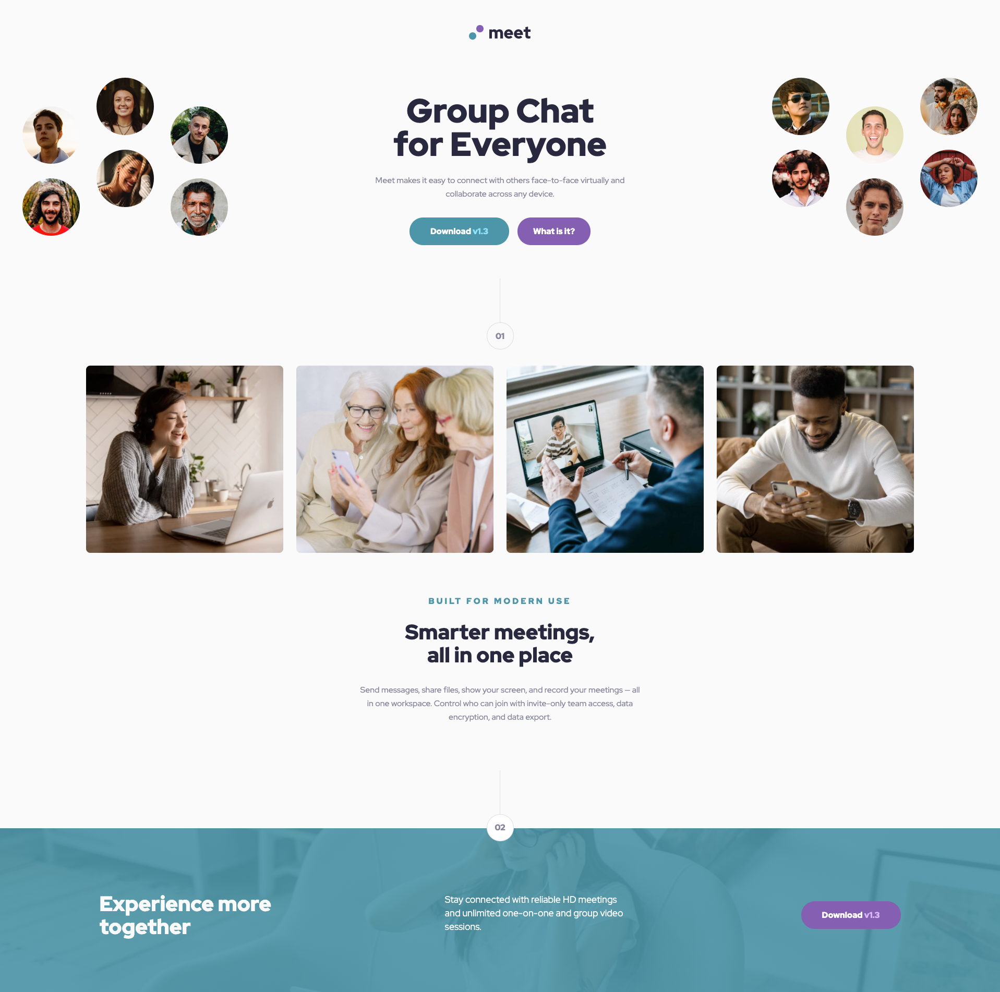
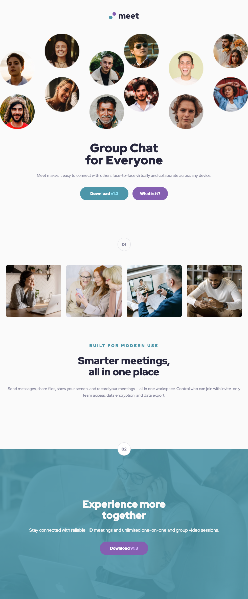

# Frontend Mentor - Meet landing page solution

This is a solution to the [Meet landing page challenge on Frontend Mentor](https://www.frontendmentor.io/challenges/meet-landing-page-rbTDS6OUR). Frontend Mentor challenges help you improve your coding skills by building realistic projects. 

## Table of contents

- [Overview](#overview)
  - [The challenge](#the-challenge)
  - [Screenshot](#screenshot)
  - [Links](#links)
- [My process](#my-process)
  - [Built with](#built-with)
  - [What I learned](#what-i-learned)
  - [Continued development](#continued-development)
- [Useful resources](#useful-resources)
- [Author](#author)

## Overview

### The challenge

Users should be able to:

- View the optimal layout depending on their device's screen size
- See hover states for interactive elements

### Screenshot


**Desktop version**   

---  


**Tablet version**  

---

**Mobile version**  

### Links

- Solution URL: [Add solution URL here](https://your-solution-url.com)
- Live Site URL: [Add live site URL here](https://your-live-site-url.com)

## My process

### Built with

- Semantic HTML5 markup
- CSS custom properties
- CSS Position
- Flexbox
- CSS Grid
- Mobile-first workflow

### What I learned

- In this project I learned how to combine CSS Flexbox, Grid and Position to achieve the required design.
- Moreover I also learned the mobile first design.

```css
.grid-container {
  display: grid;
  grid-template-columns: repeat(2, 1fr);
  grid-template-areas:
    "header-image-left header-image-right"
    "header-text header-text";
  overflow: hidden;
}
```

### Continued development

- Moreover, I will learn ReactJS and bootstrap to make this design quickly.

### Useful resources

- [The Net Ninja's Mobile First course](https://www.youtube.com/playlist?list=PL4cUxeGkcC9hH1tAjyUPZPjbj-7s200a4) - This helped me for learning mobile first design method. I really liked the way that net ninja explain and I will apply it in my future projects.


## Author

- Faceboook - [Nguyen Hoang An Facebook](https://www.facebook.com/an.nguyenhoang.10)
- Frontend Mentor - [@anhoang241998](https://www.frontendmentor.io/profile/anhoang241998)
